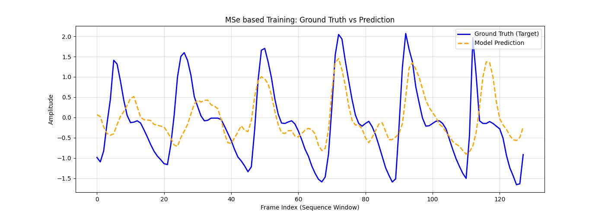
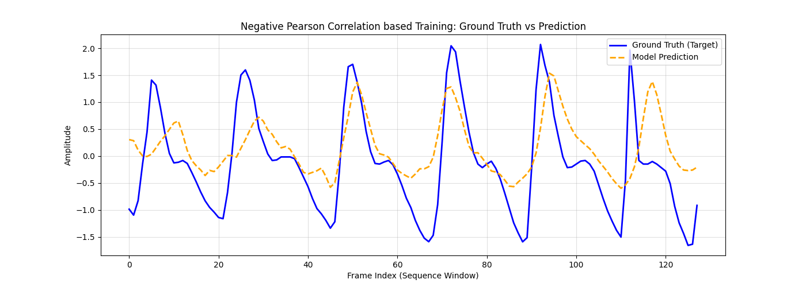
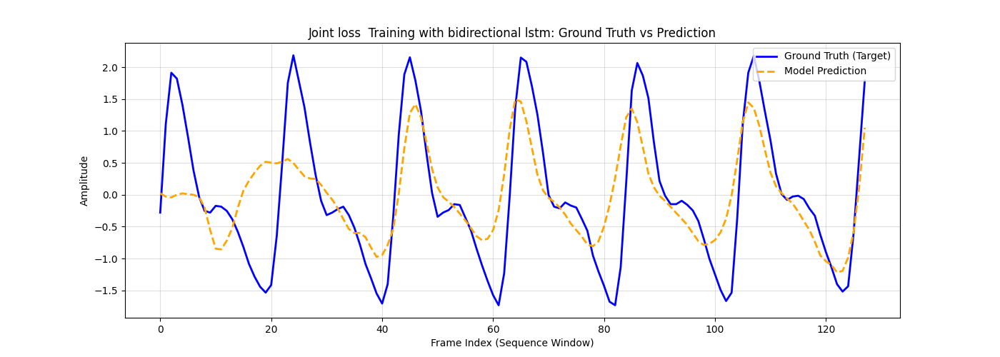
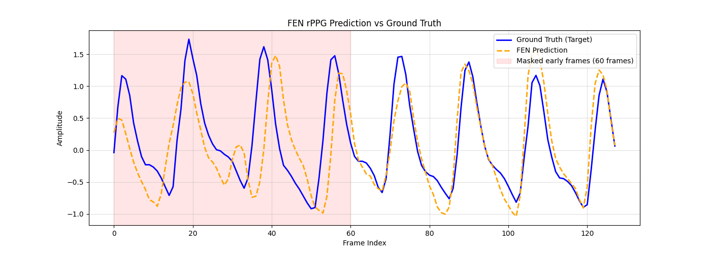

# Remote Photoplethysmography (rPPG) from Selfie Videos

Non-invasive measurement of Blood Volume Pulse (BVP) signals and vital signs (heart rate and breathing patterns) from standard camera video feeds using facial detection and deep learning sequence models.

---

## 🏗️ Repository Layout

```
.
├── final/                  # Final Transformer-based model & deployment code (In Development)
├── experiments/            # Exploratory research, notebooks, checkpoints & baseline models
│   ├── checkpoints/        # Saved model weights (.pth)
│   ├── plots/              # Prediction waveform benchmark plots
│   ├── train_experiments.ipynb
│   ├── benchmark_fen.py
│   └── data_preparation.ipynb
├── data/                   # Dataset cache (UBFC-RPPG Dataset)
├── yunet.onnx              # YuNet lightweight face detection model
└── README.md
```

---

## 🚀 Production Target: Transformer-Based Pipeline (`final/`)

The upcoming production pipeline under [`final/`](final) deploys an attention-based **Transformer architecture** tailored for rPPG waveform reconstruction and real-time inference.

### Core Processing Flow
1. **Face & ROI Extraction**: Lightweight face tracking via YuNet (`yunet.onnx`) extracts 3 key skin regions: Forehead, Left Cheek, and Right Cheek.
2. **Spatial Feature Reduction**: Spatial BGR color averaging per ROI yields a compact 9-dimensional frame feature vector.
3. **Temporal Normalization**: Per-window min-max sequence normalization isolates dynamic blood volume pulsation (AC component) from static skin tone and lighting variations (DC component).
4. **Transformer Waveform Prediction**: Self-attention layers capture long-range temporal dependencies and fine-grained pulse periodicity across frame sequences.

---

## 🧪 Exploratory Experiments Summary (`experiments/`)

During the initial phase, multiple recurrent architectures (LSTM, Bidirectional LSTM, FEN) and loss functions were evaluated on the **UBFC-RPPG Dataset**.

| Model Architecture | Loss Function | Best Val Loss | Key Finding | Benchmark Visualization |
| :--- | :--- | :---: | :--- | :---: |
| **LSTM (MSE)** | `MSELoss` | `0.3419` | Tracks frequency but shows amplitude damping & phase lag |  |
| **LSTM (Pearson)** | `1 - Pearson` | `0.2554` | Realigns phase sync and peak timing |  |
| **BiLSTM (Joint)** | `Pearson + MSE` | `0.2100` | Bidirectional tracking improves both phase and amplitude rhythm |  |
| **Feature-Escrow Net (FEN)** | Weighted `Pearson + MSE` | **`0.1848`** | Subtractive routing prevents temporal feature bloat; best baseline |  |

> 📁 All experimental notebooks, custom loss scripts, model checkpoints, and complete benchmark logs are archived in [`experiments/`](experiments).

---

## ⚡ Environment & Setup

### Requirements
```bash
pip install torch numpy opencv-python matplotlib pandas
```

### Face Detection Model
Ensure `yunet.onnx` is available in the root directory for facial landmark and ROI detection.
